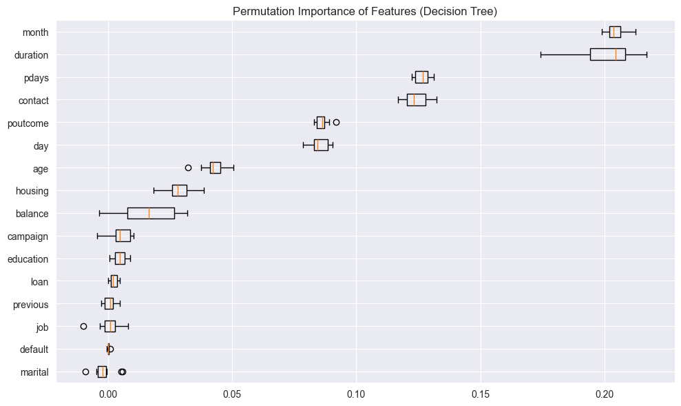

# An Comparison of Classification Models for Bank Marketing Data
## Problem Statement
The data is related with direct marketing campaigns of a Portuguese banking institution. The marketing campaigns were based on phone calls. Often, more than one contact to the same client was required, in order to access if the product (bank term deposit) would be ('yes') or not ('no') subscribed. The classification goal is to predict if the client will subscribe (yes/no) a term deposit account (variable y).

## Methodology
We will be comparing different classification models. The models that we will be comparing are:
1. Logistic Regression
2. K-Nearest Neighbors
3. Decision Tree
4. Support Vector Machine

Standardization will be done with a standard scaler and categorical data would be label encoded.
In this scenario, we would want to know our true positives which would indicate precision is probably the more important score.
Recall is probably also useful because it helps us understand if the model is missing a lot of potential clients that could be interested in the term deposit.

## Results
Logistic Regression Results:
Confusion Matrix:

[7792  160]

 [ 854  237]

    Classification Report:
                  precision    recall  f1-score   support
    
               0       0.90      0.98      0.94      7952
               1       0.60      0.22      0.32      1091
    
        accuracy                           0.89      9043
       macro avg       0.75      0.60      0.63      9043
    weighted avg       0.86      0.89      0.86      9043

K-Nearest Neighbors Results:
Confusion Matrix:

[7694  258] 

[ 726  365]

    Classification Report:
                  precision    recall  f1-score   support
    
               0       0.91      0.97      0.94      7952
               1       0.59      0.33      0.43      1091
    
        accuracy                           0.89      9043
       macro avg       0.75      0.65      0.68      9043
    weighted avg       0.87      0.89      0.88      9043

Decision Tree Results:
Confusion Matrix:

[7363  589]

 [ 562  529]

    Classification Report:
                  precision    recall  f1-score   support
    
               0       0.93      0.93      0.93      7952
               1       0.47      0.48      0.48      1091
    
        accuracy                           0.87      9043
       macro avg       0.70      0.71      0.70      9043
    weighted avg       0.87      0.87      0.87      9043

Support Vector Machine Results:
Confusion Matrix:

[7799  153]

 [ 784  307]

    Classification Report:
                  precision    recall  f1-score   support
    
               0       0.91      0.98      0.94      7952
               1       0.67      0.28      0.40      1091
    
        accuracy                           0.90      9043
       macro avg       0.79      0.63      0.67      9043
    weighted avg       0.88      0.90      0.88      9043

## Conclusion
If the goal was to maximize precision for the class where the customer successfully opens a deposit account, then the decision tree edges out other models. The same goes for if we want to maximize recall for the successful deposit account class.
Let us also take a look at the permutation importance to determine the most important features for the decision tree model.

Looking at this, it seems that the month and duration of the campaign are the most important features for the decision tree model. The next most important are the number of days the potential customer was last contacted and the method of contact.